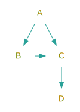

Protocols are at the heart of Swift API design. However, I had a perception problem with this concept 😜. In my mind [*Protocol Oriented Programming*](https://developer.apple.com/videos/play/wwdc2015/408/)[^1] meant the possibility to generically extend types. Turns out, I was looking from the wrong angle.


## Objective-C heritage

Objective-C protocols declare methods expected to be implemented by an object. Thanks to that we have an alternative method of *assuming*[^2] that an object can be used in particular place.
 
```objc
- (void)foo:(id<Bar>)object;
```

For example this declaration of `foo:` means 'I don't care about `object's` class as long as it implements methods declared in `Bar`'. 

Up to 2.0, Swift protocols were used just like their Objective-C counterparts. It changed with protocol extensions but my it didn't change the way I structured code.

I used to think about them as a way to make all instances which conform to a protocol **also** do something else. Now, I think I was wrong and here's what I learned.
 
## The eureka case

I was learning about [graphs](https://en.wikipedia.org/wiki/Graph_(discrete_mathematics)) and I wanted to fully understand the subject by implementing various algorithms.

A graph represents a system of relations between objects. For my needs I only needed one way parent -> children relation. It could be expressed using `structs`/`classes`.

```swift
struct Node<T> {
    let value: T
    var children: [Node<T>] = []
}

struct Graph<Element> { 
    var nodes: [Element] = []
    ... // The things you can do with it
}
```

or alternatively with protocols

```swift
protocol Node {
    var children: [Self] { get }
}

protocol Graph {
    associatedtype T : Node
    var nodes: [T] { get }
}

extension Graph {
 ... // The things you can do with it 
}
```

I chose the latter.

## Protocols define actions on state

The meaning of these declarations is very different:

- The struct says 'give me objects, I will build a graph out of it and you can do things with it.'
- The protocol approach means 'given an object which is of a recursive type you can do the following.' 

With protocols we can model a program around concrete definitions of **actions on generic state**. Every conformance provides a new context a type can be used in. Thus, whenever you make a type conform to a protocol, you incorporate new functionality which can be performed with that instance.

### Example

```swift
struct Project {
    var dependencies: [Project]
}
```

An instance of `Project` might have several dependencies which might have other depedencies. The dependency graph of projects `A`, `B`, `C`, and `D` could look like this.

{: style="display: block; margin: 0 auto"}

In fact every `Project` struct is a node in `dependencies` graph, and every instance defines a subgraph of its dependencies. `Project` is a perfect candidate to conform to `Graph` and `Node`.

```swift
extension Project: Node, Graph {
    var children: [Project] { return dependencies }
    var nodes: [Project] { return dependencies }
}
```

The protocol understands the state of `Project` almost out of the box. `Graph` extension contains some popular generic algorithms on graphs. For example you might be interested if there are cirucular relationships (i.e. dependencies).

Using `Graph` **struct** would introduce another layer of complexity. Whenever we wanted to do something that includes any generic graph operation, we would have to wrap the whole `Project` graph into the struct and unwrap it later on. It wouldn't feel right. **It's like wrapping a gift twice**.

In real world software, state and what we do with it changes frequently. Protocols introduce a great opportunity to separate them. Therefore, it is easier for me to reason about proper abstractions this way.

In order to see some real life examples of this look no further than the [Standard Library](https://github.com/apple/swift/tree/master/stdlib). Functions like `map`, `reversed` or `reduce` are all defined as an extension of `Collection` protocol. For instance [`map`](https://github.com/apple/swift/blob/master/stdlib/public/core/Collection.swift#L305) operates on `count` and `startIndex` of a collection. 

## Lesson learned

<style>
#definition {
    background-color: #E5E5E5;
    
};
</style>

I learned to think about protocols as <span id="definition">*descriptions of actions on state*</span> instead of <span id="definition">*descriptions of state, actions can be performed on*</span>. In extreme situations like `Graph` and `Project` it means adding new functionality at zero cost. In other cases, it can significantly reduce refactoring costs. It also introduces beautiful separation of concerns.


---

You can do many fun things with `Graph` data structure but I am not going to dive into it here. The whole micro library is available on [Github]()

You can find other interesting articles on protocols [here](http://alisoftware.github.io/swift/protocol/2015/11/08/mixins-over-inheritance/), [here](http://matthijshollemans.com/2015/07/22/mixins-and-traits-in-swift-2/), and [here](https://www.dzombak.com/blog/2015/06/Multiple-Inheritance-vs--Traits-or-Protocol-Extensions.html).

[^1]: I probably didn't pay close attention during this talk since it pretty clearly conveys a similar message
[^2]: It's still Objective-C 😉

